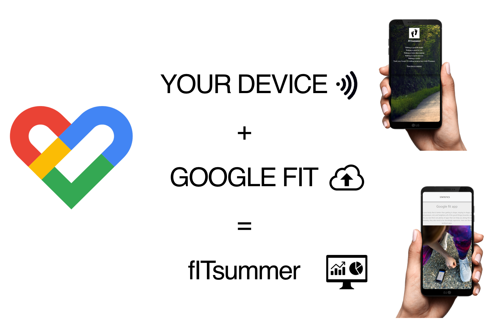

# fITsummer

fITsummer is step tracking web app which shows 7 days history in easily readable way.

# Background

Did you know that step tracking app can help motivate you to increase your activity? That’s true. 

You can wear a device or start paying attention to the steps recorded by the Google Fit app in your smartphone. 

Set your step goal at 6,000 to 10,000 per day, and find how it goes in our web app fITsummer.

# The Setup

Web

fITsummer is web app. It is build to access to your step data from Google fit store.

Pre-requisites

Screenshots

Installation

Setup

Starting It Up

Examples

Meta